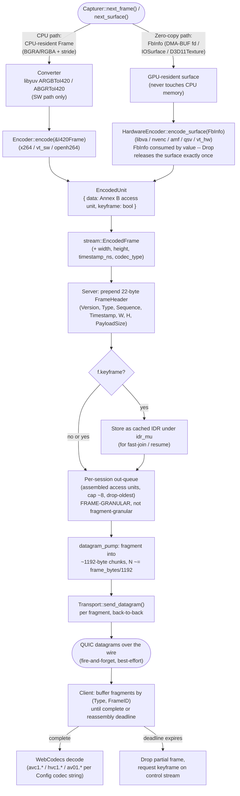

# Data Flow — One Video Frame, Capture to Decode

Traces a single frame through both encode paths, per
`specs/media/MODULE_CAPTURE.md`, `MODULE_ENCODE.md`, `MODULE_HARDWARE_ENCODE.md`,
`specs/core/MODULE_SERVER.md`, and `MODULE_TRANSPORT.md`. The two paths are
mutually exclusive per session (the Pipeline picks one encoder) but converge on
an identical `EncodedUnit` → `EncodedFrame` → wire contract.

**Why the two paths converge so early.** The Server, IDR cache, datagram
fragmentation, and client reassembly logic are all encoder-agnostic — they
operate on `EncodedFrame`/`EncodedUnit`, never on pixels or GPU handles. This
is deliberate: it means the entire back half of the pipeline (from `EncodedUnit`
onward) is implemented and tested exactly once, regardless of which of the six
encoder add-ons produced the frame.

**Ownership discipline on the hardware path.** `FbInfo` is moved *by value*
into `encode_surface`; its `Drop` releases the GPU resource exactly once on
every outcome (success, error, or `StreamError::FallbackToSoftware`) — this is
the fix for the old Go code's TD-01 DMA-BUF file-descriptor leak, where cleanup
depended on manually calling a `Release func()` on every exit path.
