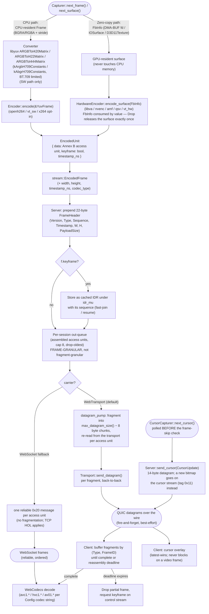

# Data Flow — One Video Frame, Capture to Decode

Traces a single frame through both encode paths, per
`specs/media/MODULE_CAPTURE.md`, `MODULE_ENCODE.md`, `MODULE_HARDWARE_ENCODE.md`,
`specs/core/MODULE_SERVER.md`, and `MODULE_TRANSPORT.md`. The two paths are
mutually exclusive per session (the Pipeline picks one encoder) but converge on
an identical `EncodedUnit` → `EncodedFrame` → wire contract.

**Why the two paths converge so early.** The Server, IDR cache, datagram
fragmentation, and client reassembly logic are all encoder-agnostic — they
operate on `EncodedFrame`/`EncodedUnit`, never on pixels or GPU handles. This
is deliberate: it means the entire back half of the pipeline (from `EncodedUnit`
onward) is implemented and tested exactly once, regardless of which of the six
encoder add-ons produced the frame.

**The cursor leaves the diagram's main spine on purpose.** `next_cursor()` is
polled on the frame-loop tick *before* the frame-skip check, and its output goes
straight to `send_cursor` — it never enters the converter, the encoder, the IDR
cache, or the out-queue. That is what keeps the pointer moving while video is
skipped, dropped, or static, and it is why a cursor-path error must not advance
the capture-error ladder (see CENTRAL_SPEC Contract 8).

**Ownership discipline on the hardware path.** `FbInfo` is moved *by value*
into `encode_surface`; its `Drop` releases the GPU resource exactly once on
every outcome (success, error, or `StreamError::FallbackToSoftware`). This
replaces the Go capturer's two-site fd discipline — `internal/capture/kms.go`
closes the previous DMA-BUF fd at the top of the next `NextFrame` and the last
one in `Close`, which is correct but depends on every early return leaving
exactly one fd in `lastDMAFD` (TD-01).
