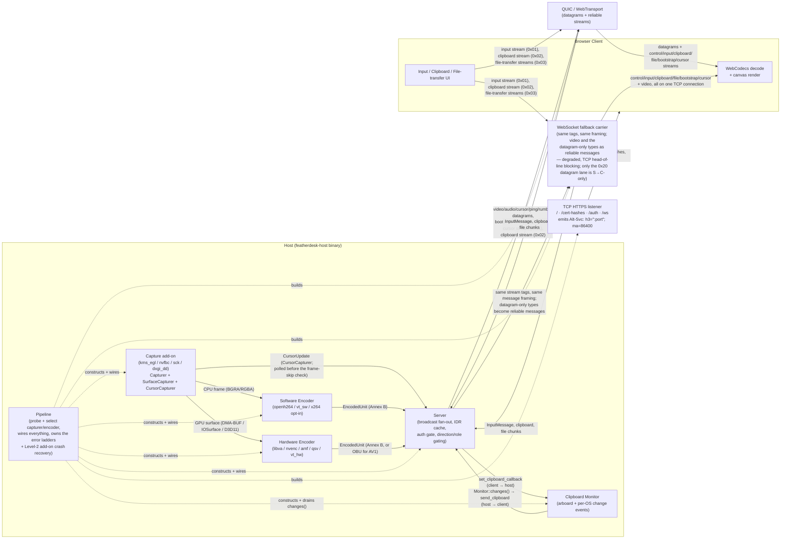

# High-Level Design

System-level view of FeatherDesk: one host desktop captured, encoded, and streamed
to one or more browser clients over a single QUIC/WebTransport session per client —
or, where UDP is blocked, over the degraded WebSocket fallback carrier. Derived from
`specs/CENTRAL_SPEC.md` (Module Dependency Graph, Frame Types) and
`specs/core/MODULE_TRANSPORT.md` (channel model, carrier selection).

**Cursor and clipboard are the two flows that are easy to draw wrong.** Both are
*bidirectional or off-path*, so a diagram that only follows the video pipeline
misses their producer side entirely:

- **Cursor** is produced by the **capture add-on** (`CursorCapturer`), not by the
  encoder — it deliberately bypasses encode so the pointer keeps moving while
  video is skipped, dropped, or static. It is split across two lanes: position and
  visibility are a fixed 14-byte latest-wins datagram, while the bitmap is a
  reliable record on the per-session cursor stream (tag `0x11`), because a
  half-delivered cursor image is useless. See CENTRAL_SPEC Contract 8.
- **Clipboard** is genuinely symmetric and wired two *different* ways: host→client
  is a **push** the pipeline drains from `Monitor::changes()`, client→host is a
  **callback** the server invokes. See CENTRAL_SPEC Contract 9.

**Two encode paths, one output contract.** Software encoding (CPU-resident
frames, converted to I420 via libyuv) and hardware encoding (zero-copy GPU
surfaces) are mutually exclusive per session — the Pipeline probes hardware
encoders first and falls back to software — but both produce the same
`EncodedUnit` type the Server consumes, so the Server, Transport, and Client
paths are identical regardless of which encoder ran.

**One connection carries everything — but two listeners answer.** The page itself,
the self-signed cert hashes, and the `/auth` token exchange are served over TCP
HTTPS, because no browser speaks HTTP/3 to an origin it has never seen; that
response carries `Alt-Svc: h3=":<port>"; ma=86400`, which is how the browser
learns to try QUIC at all. Once it does, video, audio, cursor, input, clipboard,
and file transfer all multiplex over a single WebTransport session per client.
Where UDP is blocked, the same streams ride a WebSocket fallback carrier — same
stream tags, same message framing, only the carrier differs, and the datagram-only
types (`PING`, cursor position, `GAMEPAD_RUMBLE`) become reliable messages. That
mode is **degraded, not equivalent**: TCP head-of-line blocking means one lost
segment stalls every stream behind it. See `NETWORK_FLOW.md` for the lifecycle and
`DATA_FLOW.md` for one frame's journey end-to-end.
