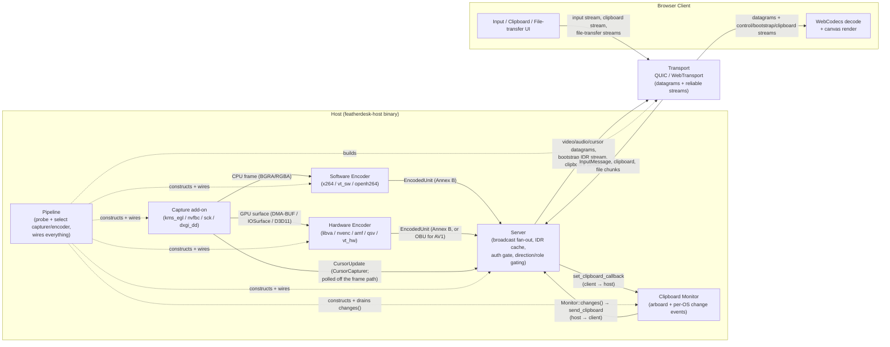

# High-Level Design

System-level view of FeatherDesk: one host desktop captured, encoded, and streamed
to one or more browser clients over a single QUIC/WebTransport connection per
client. Derived from `specs/CENTRAL_SPEC.md` (Module Dependency Graph, Frame
Types) and `specs/core/MODULE_TRANSPORT.md` (channel model).

**Cursor and clipboard are the two flows that are easy to draw wrong.** Both are
*bidirectional or off-path*, so a diagram that only follows the video pipeline
misses their producer side entirely:

- **Cursor** is produced by the **capture add-on** (`CursorCapturer`), not by the
  encoder — it deliberately bypasses encode so the pointer keeps moving while
  video is skipped, dropped, or static. See CENTRAL_SPEC Contract 8.
- **Clipboard** is genuinely symmetric and wired two *different* ways: host→client
  is a **push** the pipeline drains from `Monitor::changes()`, client→host is a
  **callback** the server invokes. See CENTRAL_SPEC Contract 9.

**Two encode paths, one output contract.** Software encoding (CPU-resident
frames, converted to I420 via libyuv) and hardware encoding (zero-copy GPU
surfaces) are mutually exclusive per session — the Pipeline probes hardware
encoders first and falls back to software — but both produce the same
`EncodedUnit` type the Server consumes, so the Server, Transport, and Client
paths are identical regardless of which encoder ran.

**One connection carries everything.** Video, audio, cursor, input, clipboard,
and file transfer all multiplex over a single WebTransport session per client
(see `NETWORK_FLOW.md` for the connection lifecycle and `DATA_FLOW.md` for one
frame's journey end-to-end).
