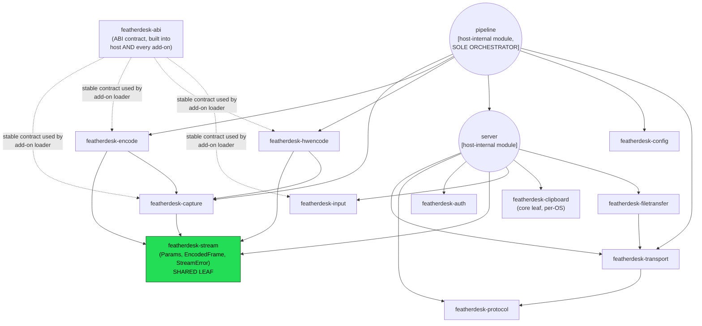

# Low-Level Design — Module / Crate Dependency Graph

Converts the ASCII "Module Dependency Graph" in `specs/CENTRAL_SPEC.md`
(~line 812) into Mermaid, with the crate/module distinction from the "File
Structure" and "Crate ↔ spec map" sections preserved: solid boxes are
standalone library crates; dashed boxes are modules living inside the
`featherdesk-host` binary (`server` and `pipeline` are **not** separate
crates).

**Invariants this graph must preserve** (from `CENTRAL_SPEC.md`):

- **No cycles** — Cargo forbids them anyway; every crate is a leaf or
  near-leaf depending only on `std` + system libs via FFI.
- **`stream` is the shared leaf** — every media/server crate depends on it for
  `Params` / `EncodedFrame` / `StreamError`; it depends on nothing else here.
- **`pipeline` is the sole orchestrator** — it is the only node that imports
  every core interface (capture, encode, hwencode, server, config, transport)
  and builds the `Transport`. No other module reaches across this many
  boundaries.
- **`hwencode` and `encode` are siblings, not parent/child** — both depend on
  `capture` + `stream` independently; an add-on implements one or the other,
  never both.
- **`protocol` is shared with the client** — it's pure data (wire types,
  encode/decode), no logic dependencies, which is why the browser client can
  use the identical frame/message definitions.
- Audio (`featherdesk-audio`) is omitted from the graph above for the same
  reason `CENTRAL_SPEC.md` omits it: implementation is deferred.
