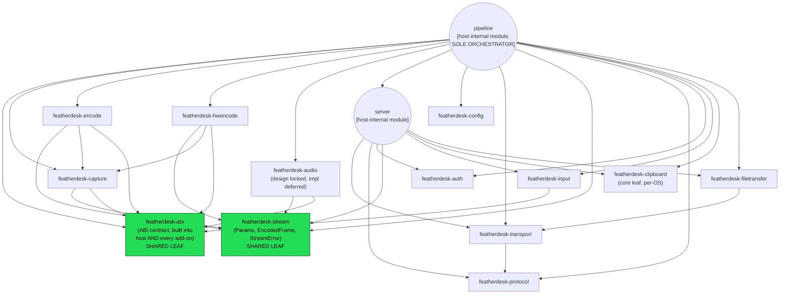

# Low-Level Design — Module / Crate Dependency Graph

Converts the ASCII "Module Dependency Graph" in `specs/CENTRAL_SPEC.md` into
Mermaid, with the crate/module distinction from the "File Structure" and
"Crate ↔ spec map" sections preserved: rectangles are standalone library crates;
the two circular nodes are modules living inside the `featherdesk-host` binary
(`server` and `pipeline` are **not** separate crates). Every edge points
dependent → dependency.

**Invariants this graph must preserve** (from `CENTRAL_SPEC.md`):

- **No cycles** — Cargo forbids them anyway; every crate is a leaf or
  near-leaf depending only on `std` + system libs via FFI.
- **`stream` is the shared leaf** — every media/server crate depends on it for
  `Params` / `EncodedFrame` / `StreamError`; it depends on nothing else here.
- **`pipeline` is the sole orchestrator** — it is the only node that imports
  every core interface (capture, encode, hwencode, audio, server, config,
  transport, abi, stream, protocol, auth, input, clipboard, filetransfer) and
  builds the `Transport`. No other module reaches across this many boundaries.
- **`hwencode` and `encode` are siblings, not parent/child** — both depend on
  `capture` + `stream` independently; an add-on implements one or the other,
  never both.
- **`protocol` is shared with the client** — it's pure data (wire types,
  encode/decode), no logic dependencies, which is why the browser client can
  use the identical frame/message definitions.
- **`abi` is a shared leaf, and every arrow into it points inward** — every crate
  that faces an add-on (`capture`, `encode`, `hwencode`, `input`, `audio`) plus
  `pipeline`, which owns the Layer-2 adapters, depends on `featherdesk-abi`; it
  depends on nothing here. Drawing these edges outward would say the ABI contract
  imports its consumers, which is the opposite of the dlopen model.
- **Audio is in the graph** — `audio -> stream` for `StreamError` and
  `pipeline -> audio` for selection, with `AudioLoop::open` constructing on the
  audio thread and `AudioLoop::run` driving it. Its implementation is
  deferred; its dependency edges are not, and omitting them makes any "who calls
  this" cross-check blind to the audio path. `server` never imports `audio`:
  encoded chunks reach it as bytes through `broadcast_audio`.
