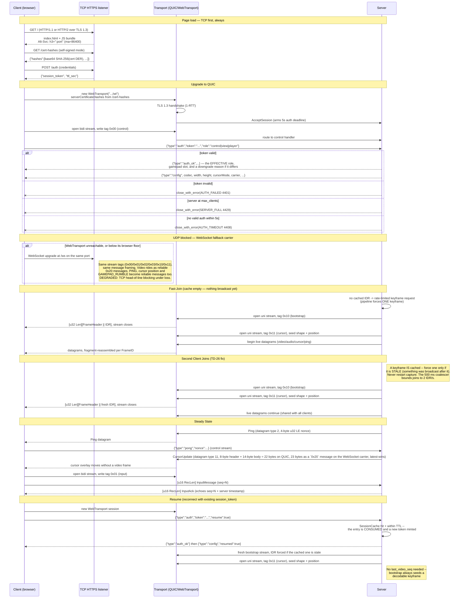

# Network Flow — Connection Lifecycle

Sequence of a client loading the page, authenticating, upgrading to QUIC, and
joining an in-progress stream, per `specs/core/MODULE_SERVER.md` (its
HTTP-endpoints table and "Keyframe Caching Strategy") and
`specs/core/MODULE_TRANSPORT.md` ("Connection Lifecycle", "Stream
Identification", "Carrier selection"). Two things are easy to draw wrong and are
drawn explicitly here: **the first three requests are TCP**, because no browser
speaks HTTP/3 to an origin it has not already learned about via `Alt-Svc`; and
the **second-client join** never restarts capture and forces a keyframe only
when the cached one is stale, which is the fix for TD-26 (the old Go server did
both unconditionally on every join, disrupting all existing viewers).

**Why joins never disturb existing viewers.** The keyframe cache (an assembled
`FrameHeader || Annex B` access unit plus its sequence, keyed under `idr_mu`)
means a join reads the cache and opens a bootstrap stream — it forces a new
keyframe only when the cached one is **stale**, meaning something has been
broadcast since it, which on an active screen is most joins. That cost is
bounded rather than avoided: every keyframe request — join, client-requested,
or queue-drop — funnels through the one 500 ms coalescer, so a burst of joins
costs at most 2 IDR/s in total, and a join never restarts the capturer or
interrupts the datagrams already flowing to other clients. Refusing to force at
all was the over-correction; forcing one per join unconditionally, and
restarting capture with it, was TD-26.

**Stream identity, not accept order.** Because QUIC doesn't guarantee streams
arrive in the order they were opened, every stream self-identifies with a
1-byte `StreamType` tag before any payload (`0x00` control, `0x01` input,
`0x02` clipboard, `0x03` file transfer, `0x10` server-opened bootstrap, `0x11`
server-opened cursor) — the server dispatches on that tag, never on which
stream was accepted first. A bad tag is a **stream-scope** error: the server
cancels that stream with `close::PROTOCOL_ERROR` and leaves the session and
every other stream running. Only the control stream can kill a session.

**The fallback carrier is the same protocol, not a second one.** When UDP is
blocked or the browser is below the WebTransport floor, the client opens a
WebSocket to `/ws` on the same port and speaks the identical stream tags and the
identical per-lane framing. Only two things differ. First, there are no
datagrams, so PING, CURSOR_UPDATE and GAMEPAD_RUMBLE arrive as `0x20`-tagged
binary messages carrying the same 8-byte DatagramHeader and body as on QUIC
(CURSOR_UPDATE = `[0x20][8][14]` = 23 bytes). They are coalesced by the
fallback send-queue policy — position is latest-wins. The `0x11` cursor lane
still carries only shape records and the single join-time Kind 0x02 position
record, on both carriers. Video is carried as one reliable message per access
unit. Second, every lane shares one TCP connection, so a lost segment
head-of-line-blocks all of them. It is a compatibility mode, not a peer of
the QUIC path.
