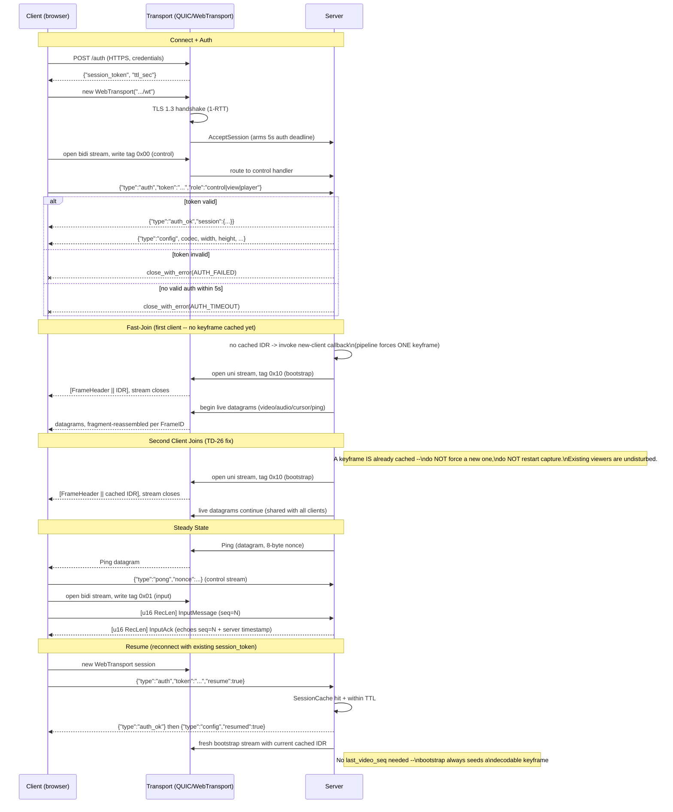

# Network Flow — Connection Lifecycle

Sequence of a client connecting, authenticating, and joining an in-progress
stream, per `specs/core/MODULE_TRANSPORT.md` ("Connection Lifecycle",
"Stream Identification") and `specs/core/MODULE_SERVER.md` ("Keyframe Caching
Strategy"). Includes the second-client-join case, which is the fix for TD-26
(the old Go server forced a keyframe *and* restarted the capture subprocess on
every join, disrupting all existing viewers).

**Why joins never disturb existing viewers.** The keyframe cache (an assembled
`FrameHeader || Annex B` access unit, keyed under `idr_mu`) means a join only
needs to *read* the cache and open a bootstrap stream — it forces a new
keyframe **only** when no client has ever connected. Every subsequent join,
including the second, tenth, or after a client resumes mid-session, is served
from cache with zero impact on the live capture/encode loop or the datagrams
already flowing to other clients.

**Stream identity, not accept order.** Because QUIC doesn't guarantee streams
arrive in the order they were opened, every stream self-identifies with a
1-byte `StreamType` tag before any payload (`0x00` control, `0x01` input,
`0x02` clipboard, `0x03` file transfer, `0x10` server-opened bootstrap) — the
server dispatches on that tag, never on which stream was accepted first.
